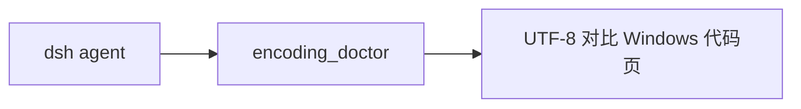

# dsh-wsl-encoding

> **套件安装：** 见 [dsh-wsl-kit](https://github.com/173787247/dsh-wsl-kit)。

工具 **`encoding_doctor`**：检查 chcp / UTF-8；可选 `path=` 抽样 CRLF（`/mnt/c` 上脚本常导致 `set: pipefail` 报错）。

[English → README.md](./README.md)

## 在套件里的位置

标出 UTF-8 和 Windows 代码页的差别，也可抽样脚本里的 CRLF。



整套关系图和版本快照：[dsh-wsl-kit 中文说明](https://github.com/173787247/dsh-wsl-kit/blob/master/README.zh.md)。本插件是 **0.2.0**（full）。不要把那份总表抄进本 README。


## 兼容性

| 项 | 值 |
|----|----|
| **插件** | `dsh-wsl-encoding` **0.2.0** |
| **最低 dsh** | ≥ **0.1.2**（Windows 中继 `:3081` 一次性 `?token=`） |
| **最新验证** | 以 [dsh-wsl-kit 兼容性](https://github.com/173787247/dsh-wsl-kit#compatibility-2026-09) 为准（当前 **`0.1.7-alpha.2`**）— 套件唯一真源 |
| **套件档位** | `full` 或单独安装 |
| **云端 Flash** | settings / `llm-deepseek` 使用 **`deepseek-flash`**（V4.1 Flash）；本插件不配置模型 id |
| **Agent Teams** | 上游实验包；本插件不依赖 |

套件版本地板：[`check-plugin-versions.sh`](https://github.com/173787247/dsh-wsl-kit/blob/master/scripts/check-plugin-versions.sh)。故障树：[TROUBLESHOOTING.zh.md](https://github.com/173787247/dsh-wsl-kit/blob/master/docs/TROUBLESHOOTING.zh.md)。

```sh
dsh plugin --profile web add github:173787247/dsh-wsl-encoding
# 例：encoding_doctor path=/mnt/c/.../restart-dsh-web.sh
npm test
```

MIT
